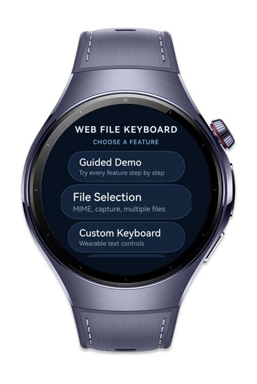
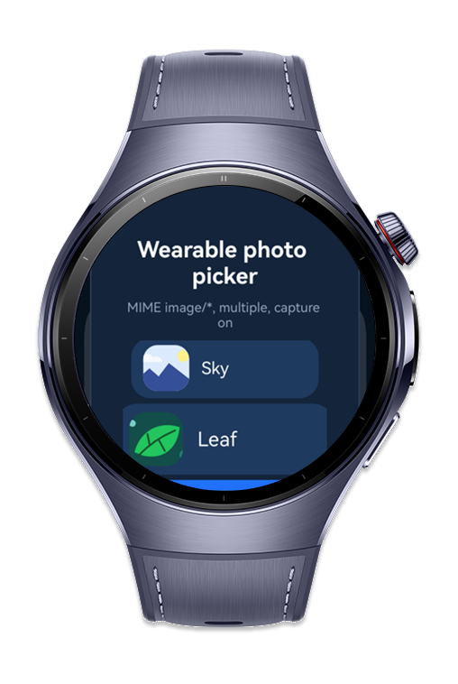
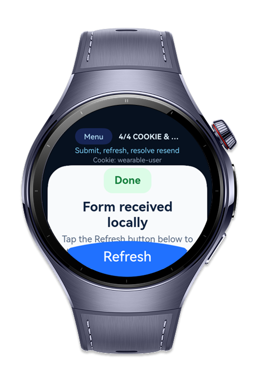
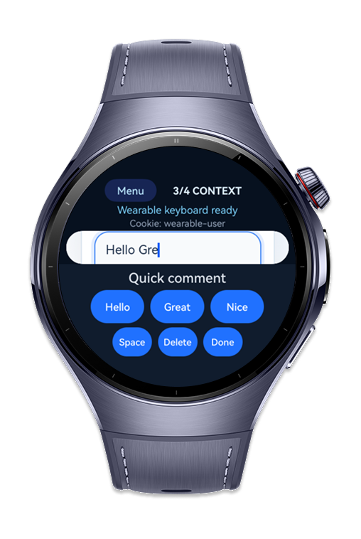

> **Note:** To access all shared projects, get information about environment setup, and view other guides, please visit [Explore-In-HMOS-Wearable Index](https://github.com/Explore-In-HMOS-Wearable/hmos-index).

# How to Build Web File Keyboard
A wearable web interaction handler that uses FileSelectorParam for accessing file input parameters (accepted MIME types, multiple selection, capture mode), FileSelectorResult for returning selected file URIs to the web page, WebKeyboardController for managing virtual keyboard display and input in web views, WebContextMenuParam for inspecting context menu trigger details (selected text, link URL, image source), WebContextMenuResult for executing context menu actions (copy, select all, look up), WebCookie for individual cookie value access, and DataResubmissionHandler for handling form data resubmission on page reload. The codelab builds a web-based file upload form with photo selection, keyboard input for comments, and context menu for text operations.

# Preview

<div>
  
  
  
  
</div>

# Use Cases
- Wearable file upload: Read an HTML file input's MIME, capture, and
  multiple-selection requirements, then return accessible file URIs.
- Compact Web text entry: Replace the system keyboard for selected Web
  fields with application-controlled wearable input actions.
- Native Web content actions: Inspect a long-pressed text, link, or image
  and provide Copy, Select all, and Find on page operations.
- Web session integration: Set and read an individual origin-scoped cookie
  for embedded Web content.
- Safe form refresh: Ask the user whether POST data should be resent or
  cancelled when a submitted page is refreshed.

# Technology
## Stack
- **Languages**: ArkTS
- **Frameworks**: HarmonyOS SDK 6.1.1(24)
- **Tools**: DevEco Studio Version 6.1.1
- **Libraries**: ArkWeb Kit, ArkUI Kit, Ability Kit, IME Kit, Core File Kit, ArkTS Kit, BasicServices Kit, Performance Analysis Kit
## Required Permissions
No need any permission for this codelab.
# Directory Structure
```
entry/src/main/
├── ets/
│   ├── entryability/EntryAbility.ets
│   ├── model/WebInteractionState.ets
│   ├── pages/Index.ets
│   └── viewmodel/WebInteractionViewModel.ets
└── resources/rawfile/
    ├── upload_demo.html
    ├── sample_sky.svg
    └── sample_leaf.svg
```
# Constraints and Restrictions
## Supported Devices
- Huawei Watch 5
- DevEco Studio Simulator
# License
How to build web file keyboard distributed under the terms of the MIT License
See the [LICENSE](./LICENSE) for more information.